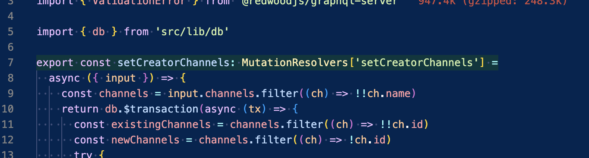

# it-list-toolbox README

## Features

- Show the functions that are covered by unit tests by highlighting the function in the source code with a green background

- `it-list-toolbox.go-to-unit-test`: Jump to the source code. Have the cursor on the function name and open the command palette and search for "go to unit test", alternatively assign a keybord shortcut to this command

- `it-list-toolbox.create-component`: Create a component with the name under the cursor. We want to enforce having only one component per folder and this is useful to create a subcomponent inside a subfolder. If you execute this component while your cursor is over `MyComponent`, it will create `MyComponent/MyComponent.tsx` with the boilerplate code for that component.

## Requirements

In a ts project, your test files must have the extension .test.ts and be inside the same folder as the implementation or a parent folder.

The test file must contain `describe('nameOfTheFunction')` in order to be recognized as the test for the function
